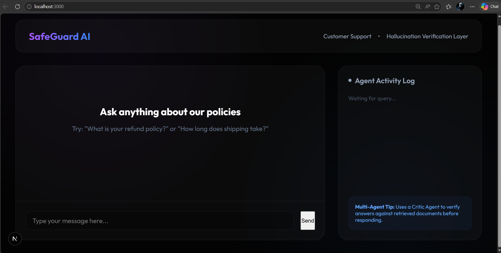
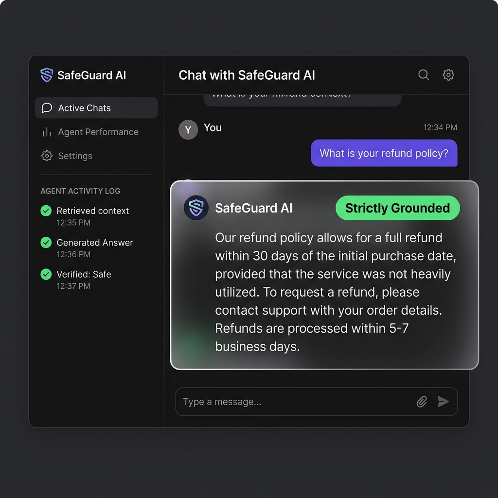

# SAFE_GUARD AI 🛡️

**SAFE_GUARD AI** is a multi-agent Retrieval-Augmented Generation (RAG) system designed for customer support with an integrated hallucination verification layer. It ensures that AI responses are strictly grounded in provided documentation, preventing "hallucinations" and ensuring accuracy.

## 🚀 Key Features

- **Multi-Agent Workflow**: Utilizes a specialized workflow where answers are generated and then rigorously verified by a "Critic" agent.
- **Hallucination Detection**: Automatically identifies and corrects facts that are not supported by the underlying knowledge base.
- **Strict Grounding**: Only answers based on provided documents, ensuring high-fidelity customer support responses.
- **Beautiful UI**: An interactive, modern glassmorphism interface built with Next.js.
- **FastAPI Backend**: High-performance Python backend powered by LlamaIndex and OpenRouter.

## 📸 Interface Preview

### Initial State

*The clean, modern starting interface for SafeGuard AI.*

### Grounded Response

*The system in action: showing a verified, strictly grounded response with the agent activity log.*

## 🏗️ Architecture

- **Frontend**: Next.js 15, Vanilla CSS, Glassmorphism UI.
- **Backend**: FastAPI, LlamaIndex, Python 3.10+.
- **LLM**: Google Gemini 2.0 Flash (via OpenRouter).
- **Vector Store**: ChromaDB (with BGE-small embeddings).

## 🛠️ Getting Started

### Prerequisites

- Python 3.10+
- Node.js 18+
- OpenRouter API Key

### Installation

1. **Clone the repository**:
   ```bash
   git clone https://github.com/Jagan-1807/SAFE_GUARD.git
   cd SAFE_GUARD
   ```

2. **Backend Setup**:
   ```bash
   cd backend
   # Create and activate venv
   python -m venv venv
   .\venv\Scripts\activate
   # Install dependencies
   pip install -r requirements.txt
   # Setup environment variables
   echo "OPENROUTER_API_KEY=your_key_here" > .env
   ```

3. **Frontend Setup**:
   ```bash
   cd ../frontend
   npm install
   ```

4. **Run the Application**:
   From the root directory:
   ```bash
   npm run dev
   ```

## 📄 Documentation

Project policies and ground truth data are located in the `docs/` directory. The system reads these files to provide grounded answers.

---
Built with ❤️ by [Jagan](https://github.com/Jagan-1807)
